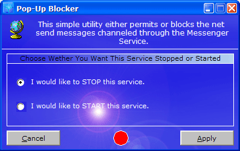



## Pop Up Blocker

### Description

This utility either stops or permits the Messenger service. This service, if permitted, allows users to send annoying 'Net Send' messages to your computer. I have seen tons of requests for a program like this; and even websites that are selling an application with the exact same functionality as this one for over $50...crazy. Anyway, if these messages are annoying you, this is the program for you. Hope it helps you out. Comments, threats, jokes are always appreciated! :) By the way, this was tested on a Windows XP machine; nothing else. If it doesn't work for any other operating system, please let me know.
 
### More Info
 

             |
---                |---
**Submitted On**   |2003-03-16 20:33:18
**By**             |[Daniel W\. Elkins](https://github.com/Planet-Source-Code/PSCIndex/blob/master/ByAuthor/daniel-w-elkins.md)
**Level**          |Beginner
**User Rating**    |4.8 (24 globes from 5 users)
**Compatibility**  |VB 3\.0, VB 4\.0 \(16\-bit\), VB 4\.0 \(32\-bit\), VB 5\.0, VB 6\.0, VB Script, ASP \(Active Server Pages\) , VBA MS Access, VBA MS Excel
**Category**       |[Complete Applications](https://github.com/Planet-Source-Code/PSCIndex/blob/master/ByCategory/complete-applications__1-27.md)
**World**          |[Visual Basic](https://github.com/Planet-Source-Code/PSCIndex/blob/master/ByWorld/visual-basic.md)
**Archive File**   |[Pop\_Up\_Blo1560703162003\.zip](https://github.com/Planet-Source-Code/daniel-w-elkins-pop-up-blocker__1-44065/archive/master.zip)

